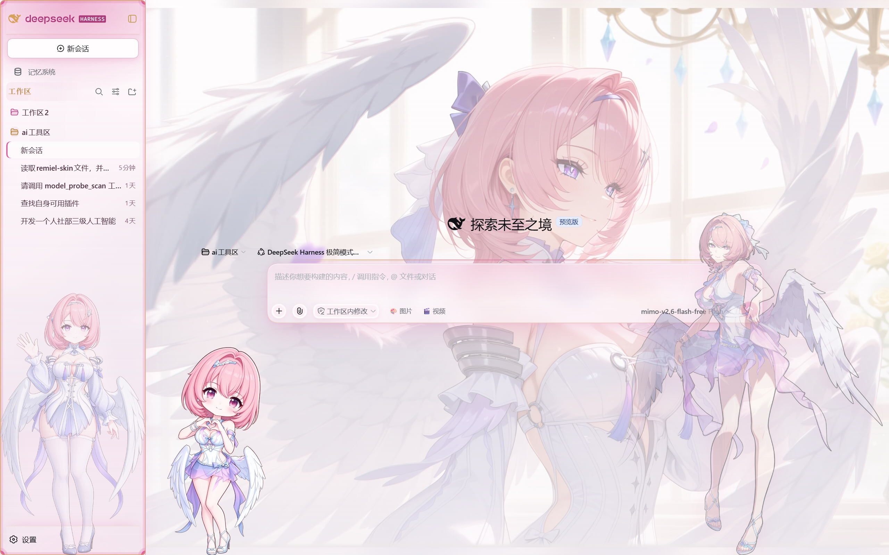
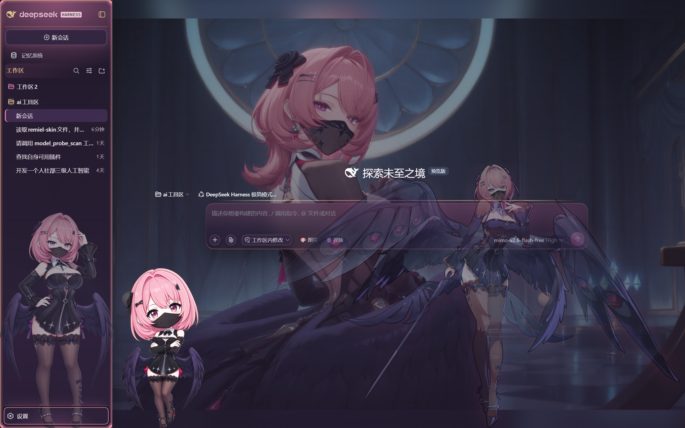

# dsh-remiel-skin · 蕾米埃尔·时隙流明

> 「嗨，要和我…共舞一曲吗？」——把 DeepSeek Harness 的 Web 界面，换成蕾米埃尔的月夜舞会。

<div align="center">


</div>

一个给 **DeepSeek Harness Web GUI** 使用的**界面皮肤插件**（区别于人格皮肤 [`../SKIN.md`](../SKIN.md)）——以《绝区零》S 级代理人 **蕾米埃尔·丹** 为灵感的粉调流明主题，明暗双模式。

- 🌸 **明模式「曙色颂」**：象牙白底、玫瑰粉强调、金线描边
- 🌙 **暗模式「月夜密语」**：柔和紫夜（v0.1.1 应反馈调浅）、流明粉高光、荣勋金细线
- 🖼️ **场景背景（v0.3.0）**：全屏铺底画——明模式「影池独舞」、暗模式「月夜密语」，带可读性薄纱与毛玻璃界面层，不再是空渐变
- 🎀 **角色立绘**：蕾米埃尔本尊常驻界面右缘——欢迎页完整登场（`opacity .96`），进入对话后降为 `.42` 清晰在场
- 🎯 **纯 token 皮肤**：覆盖 `--dsw-alias-*` 主题变量，全界面协调换色，而非逐个元素打补丁
- ✨ **舞会装潢（v0.2.0）**：舞池菱格地面、天鹅绒侧栏 + 玫瑰金缝线、CSS 蕾丝花边的输入卡、发丝线对话卡、金框表格与引用——深海女仆工坊级别的密度，玫瑰与荣勋金的配色
- 📦 **零构建**：纯手写 JS + CSS，克隆即装；立绘 base64 内嵌，场景图走本地资源路由（sha256 文件名 + 一年期不可变缓存）

## 📂 结构

```
remiel-skin/
├── README.md              ← 仓库总览（人格皮肤 + 界面皮肤）
├── SKIN.md                ← 人格皮肤（System Prompt 用）
└── ui-skin/               ← 本目录：DSH 界面皮肤插件
    ├── README.md
    ├── package.json       ← dsh.bundle + dsh.client 声明
    ├── cordis.patch.yml   ← 向 web 插件花名册注册 ui-skin-remiel
    ├── skin.json          ← 皮肤元数据（皮肤管理器读取）
    ├── assets/
    │   └── scenes/        ← 场景背景 WebP（sha256 命名，经 /skin-assets/remiel/ 路由下发）
    └── lib/
        ├── index.js       ← Node 半部（场景资源路由，白名单校验）
        └── client.js      ← 浏览器半部（主题 CSS + 立绘 + 场景图层）
```

## 🚀 安装（本地）

```powershell
# 需要 pnpm 在 PATH 上；把路径换成你的克隆位置
dsh plugin --profile web add "D:\path\to\remiel-skin\ui-skin"
```

安装后**重启 DSH Web** 生效。皮肤会作为 bundle 注册进 web profile，并在启动时默认启用；在「设置 → Skins（皮肤管理）」中可停用/切换。

卸载：

```powershell
dsh plugin --profile web remove dsh-remiel-skin
# 然后重启 DSH Web
```

## 🎨 设计 tokens

| 用途 | 明模式 | 暗模式 |
| --- | --- | --- |
| 强调色 brand | `#e2609f` | `#f286b6` |
| 主按钮 | `#e2609f → #d14e90` | `#d9599b → #e268a7` |
| 背景基底 | `#fdf8fa`（象牙粉白） | `#241a2d`（柔和紫夜，v0.1.1 调浅） |
| 层级背景 | `#fbf2f7 → #f0dde9` | `#2b2036 → #3f2f4d` |
| 边框 | `#ecd2e1 → #d59cbc` | `#5b4567 → #896c98` |
| 链接 | `#cf4289` | `#f286b6` |
| 滚动条 | `#e7a7c8` | `#8a5f78` |
| 金线（签名） | `#d9b36a` 发丝线 | `#d9b36a` 发丝线 |

所有规则均限定在 `body[data-dsh-remiel]` 作用域内，暗模式追加 `[data-ds-dark-theme]`，不污染其他皮肤与默认主题。

## 🖼️ 场景背景（v0.3.5）

背景不再是空渐变——整屏铺上**用户从 77 张选片池里挑中的 4K 场景画**，界面各层改为半透明 + 毛玻璃，画从所有缝隙里透出来：

| 模式 | 场景画 | 处理 |
| --- | --- | --- |
| 明模式 | i2i 球厅 `00035`（2016×1224，浅亮 luma 203，v0.4.12） | 38%→78% 象牙渐变薄纱，保证文字可读 |
| 暗模式 | 复现 `00046`（2016×1152，深调 luma 76，v0.4.12） | 34%→76% 夜色渐变薄纱 |
| 备用 | 选片 #10 `wa_11`（4264×2400 亮调）/ #01 `wa_01`（8000×4496 夜调）/ 影画 Banner03 | 换法：client.js 里 `SCENE_LIGHT`/`SCENE_DARK` 换对应 sha |

- 实现：`.remiel-scene` 固定图层（`z-index: -1`，压在内容之下、画布之上），场景 WebP 经 Node 半部 `/skin-assets/remiel/<sha256>.webp` 路由下发（白名单 + ETag + 一年不可变缓存）
- ✨ **v0.3.6 换立绘**：右下角立绘换成**用户提供的两张完整立绘**——明=「影池独舞·泳装」（原图 1580×2028 竖版 → WebP 1091×1400）、暗=「月夜密语」（原图 2128×1332 **横版** → WebP 1600×1002）。暗版横构图初版按宽度锚定（`width: min(46vw,620px)`），用户反馈**太小**后 v0.3.6b 改为**与明版同高** `height: min(64vh,660px); width: auto`（宽度按横版比例自动 ≈1054px，左缘渐隐融入内容）；移动端 ≤720px 暗版单独 `width: min(84vw,440px)`
- ✨ **v0.4.16 左下角饰换新（用户点单）**：泳装Q版大头/黑色Q版大头（1536² 透明 PNG）→ **BFS 保最大连通域 + alpha 包围盒紧裁**（1305×1419 / 1301×1419、丢弃 0 像素）→ 内容 sha 上架、白名单**等量换血**（替换大头版二连，仍 20 项）；角饰 CSS 两路 `auto 400px` → **`contain` 按盒宽自适配**（旧竖条 188-210×400 → 新方版 216×235 满宽，不裁切、地平线与锚点不动）；URL 戳与 `data-skin-version` 全量 **0.4.15→0.4.16**；退役大头版二连仅出仓库、本地保留
- ✨ **v0.4.15 hero 角饰改道 centerCol 地平线（用户点单：左移 + 下移、底边与右下立绘齐平）**：diag/源码双实锤——hero 座舱不坐底（`.viewArea flex:1 0 auto` 仅 `[data-phase=active]`，hero 随欢迎内容浮空）→ 卡片锚定角饰整体悬空；0414 收窄卡后 gap 又冲到 311（比对话态 230 偏右 81）。改 `centerCol::after`：`left:14` = 对话态同轨（自动跟侧栏宽）、`bottom:0` = 与 `.remiel-art` 同一地平线、centerCol 自带 overflow 永不被裁；卡片 `::after` hero 退役（content:none）、卡宽回 952 纯观感；`pI_x6G_centerCol` 为 DSH 哈希类名需随版本复核（v0.3.7 家规）；自检改断言改道规则
- ✨ **v0.4.14 hero 卡收窄（新会话角饰跑位修复）**：diag 实测 hero `cardW=1215`、`gap`（卡片左缘−centerCol 左缘）只剩 **97 < 角饰盒 216**，centerCol `overflow:hidden`（clips 链 wSkVaW_scrollBody/pI_x6G_centerCol/pI_x6G_frame）把角饰活切 119px → 只剩半截、「不在左下角」（用户实报）；修法 = hero 态输入卡 `max-width: min(952px, calc(100% - 440px))`收窄回对话态规格，gap 自动回 ≥216 水位，角饰完整回位；URL 戳与 `data-skin-version` 全量 **0.4.13→0.4.14**
- ✨ **v0.4.13 hero 水印补位（新会话立绘遮挡修复）**：新会话空态 = 会话根 `data-phase=hero`，皮肤原先只给 `active` 配了 0.42 水印淡出，hero/settling 漏网 → 立绘 0.96 全亮、hero 宽卡右缘正好钻进立绘射程 = 「新会话立绘在表层挡视野」（DSH 源码 phase=settling/hero/active 实锤）；修法 = hero/settling 并入水印淡出规则（`!important` 护盾沿用），URL 版本戳与 `data-skin-version` 全量 **0.4.12→0.4.13**；自检新增 hero 规则断言
- ✨ **v0.4.12 场景换装（用户点单）**：明模式背景 = **i2i 球厅 `remiel_i2i_ballroom_00035`**（浅亮 luma 203）、暗模式背景 = **复现 `v1_ballroom_repro_00046`**（深调 luma 76）——用户生成的成品图直接入主场景位；两张转 WebP q92（2016×1224 / 2016×1152，242KB/185KB）按仓库惯例以**内容 sha256 命名**入册（白名单 18→**20**），旧 wa_01/wa_11 退居备用；URL 版本戳与 `data-skin-version` 全量 **0.4.11→0.4.12**（新 URL 绕开旧 immutable 缓存）；自检改断言新双场景 + twenty 计数
- ✨ **v0.4.11 岗位再调配 + 右立绘整体回退（用户点单）**：① **「右下立绘改成原来的」**——v0.4.9 缩小（56vh/560）与 v0.4.9/0.4.10 两版跟随锚定 JS **整体回退**：尺寸回 **64vh/660**、锚回原生 `right:12px` 静态、`syncArtAnchor`/`artA` 探针移除（自检改断言「不存在」）；② **左下角换大头版**——明角=**泳装大头版**、暗角=**黑色大头版**（RGBA 紧裁 561×1190 / 609×1160，hash 副本入册，白名单 16→**18**）；③ **深色工作区水印=黑色Q版1**（`Q_WM_DARK` 改指 ae439a4f，与旧暗角共用一张；黑色Q版2 退役）；明水印白色Q版1 不动
- ✨ **v0.4.10 用户手抠四连换装 + 跟随平移式锚定（滑不动破案）**：① **四张新图全链路上架**——泳装Q版1/白色Q版1/黑色Q版1/黑色Q版2（RGBA 透明但留白松 → alpha 行列阈值紧裁 591×1192 级 + hash 改名副本入册，白名单 12→**16**）；新分役：**明角=泳装Q版1、明水印=白色Q版1、暗角=黑色Q版1、暗水印=黑色Q版2**（`Q_DARK` 双役退役，拆成 `Q_CORNER_DARK`/`Q_WM_DARK` 两常量）；② **「右下立绘不会跟着滑」真凶 = v0.4.9 贴靠式锚定在右侧永远撞窗缘钳制**——暗版立绘 894px 宽，`卡右缘+24 > innerW−W−8` 恒成立 → `min()` 恒取钳制值，一动不动；改**跟随平移式**：首帧记 `off0 = 立绘左缘 − 卡右缘`，之后 `左缘 = 卡右缘 + off0` 只做窗内钳制——卡片任何横向位移/变宽都**同量平移**立绘（与左下角 Q 版同感），RO 盯 card+centerCol+art 三路、600ms 轮询兜底；③ diag 新增 **`artA` 探针**（left/clamp/cardRight/w）——再不动直接看钳制状态
- ✨ **v0.4.9 残白最后一层（去边）+ 右立绘缩小随卡联动（用户点单）**：① **「三张 Q 版抠图没扣好」三级取证**——frontier 生长(206/34)与成分级判别（≥200px 成分、距透明≤45px、包边素色环≥82% 才杀）全跑完 `killed=0`：内部大白区全部有线稿包边 = 裙/发/翼真内容；最后的结构性残白只剩 **alpha 反锯齿白描边**（深色主题下即「白晕」）→ **1px alpha 腐蚀 + 边缘 RGB 去污染**（半透明边像素取内侧邻色，不再携带旧白底色）；② **「右下立绘缩小一点」**——64vh/660 → **56vh/560**（明暗同步）；③ **「和左下角一样跟着拖对话框移动」**——新增 `syncArtAnchor`：立绘左缘 = 对话卡右缘 + 24px、贴窗缘封顶；ResizeObserver 跟拖 + 1.2s 轮询兜底 React 重挂载，无 ResizeObserver 回退原右锚；④ URL 版本戳补齐最后一处出口——`sceneAsset` 也带 `?v=0.4.9`
- ✨ **v0.4.8 URL 版本戳 + 角饰右移（白底二次投诉破案）**：① **服务端实测洗冤**——curl 实证路由已发 `no-cache` + 内容 etag、出站体 RGBA 透明 585×1144，服务器无罪 ⇒ 残留白底 = **浏览器还攥着旧 URL 的 immutable 条目**（`artAsset()` 原来不带任何 query，URL 不变就永不回头）→ 现在每个 URL 挂 `?v=0.4.8` 版本戳：路由忽略 query、浏览器视为新 URL，**连老缓存也一并绕开**（改版本号即强制全量重取）；② **角饰「往右一点 + 工作区最小时完整露出」**——460px/盒伸 250 在 hero 态（卡片变宽）会顶穿 `centerCol:hidden` 左边距被裁 → 收到 **400px、盒伸 216**（明≈204/暗≈208 宽全在盒内），右缘仍贴卡左缘；③ diag `comp` 探针新增 **`gap`（卡片左缘−centerCol 左缘）与 `cardW`**——下次再报裁切直接量出可容间隙，不再猜
- ✨ **v0.4.7 全翼退役 + 双 Q 版放大 + 缓存陷阱根除（用户点单三连）**：① **「翅膀不好看，把所有翅膀删掉」**——七处全清：翼 motif 变量 ×2、品牌行、展开搜索、空态卡（明/暗）、发送钮 hover、导轨翼层（导轨本体双丝线保留、几何不动）；自检改为「全翼绝迹」断言（无 `data:image/svg+xml`、无 `--remiel-wing`）；② **「工作区立绘还不够大」**——水印 60%→**72%**、左右贴满 `left/right:0`（紧裁后 contain 以侧栏全宽出图 ≈ 264×500）；③ **「对话框左下 Q 版要和工作区一样大」**——88px→**460px**：空内容伪元素缩不起来，盒子改显式 `left/width/top/bottom`（-250/250/-470/-6），Q 版 `right 0` 右缘正贴卡片左缘；④ **「深浅都有白底」真凶 = ETag 缓存陷阱**——原实现「immutable 一年缓存 + name 派生 ETag」，原地改内容不改名 → If-None-Match 永远 304 → **Ctrl+F5 也回放旧白图**；node 半部改 `Cache-Control: no-cache` + **内容 hash ETag**（`sha256(bytes)` 前 16 位），改完文件软刷新即生效
- ✨ **v0.4.6 三症修复（白框真凶落网 + 双装饰改道）**：① **「白色背景框」= PNG 自带白底**——三张 Q 版实为 RGB 无透明、83% 近白 → 边缘 BFS 抠白（按通道判近白 228/14，不吃 PIL 三通道和阈值那套）+ 3×3 去噪斑 + 保留最大连通域≥8% + alpha 行列阈值紧裁 → 585×1144 级透明紧身图，白框绝迹；② **对话框顶翼 & 左下 Q 版 v0.4.5 整包隐形**（`z-index:-1` + 三值 position 可疑）→ **改道已证路径**：翼迁入**导轨 ::before**（老圆点就在这里渲染过），盒 `top:-24/h27` 双翼 38×20 落在双丝线正上方；Q 版改**无 z、无 calc、全素语法**的 ::after，坐卡左缘外伸 46px 只与卡角相接；③ **左栏水印放大加浓**：44%→60%、透明 0.14→**0.5**（暗 0.2→0.58）、mask 实心区 38%→46%——「太小太淡看不清」一次修三；④ diag 新增 **`comp` 探针**（::before/::after 背景长度 + 祖先 overflow 裁剪链），再隐形可远程定位
- ✨ **v0.4.5 对话框装饰包 + Q版三连（用户点单）**：① **对话框顶缘对称展翅一对**——`[data-composer-card]::after`（v0.4.2 腾出的空位）外溢盒 `inset:-34px -14px -14px -56px`，双翼 38×20 骑卡心（盒偏移校准 `calc(50%+2)/calc(50%+40)`），落在双丝线导轨正上方；`z-index:-1` 借卡片 `backdrop-filter` 自成的 stacking context，**骑卡面、不压输入字**；② **对话框左下角 Q 版倚靠**——明=泳装Q版、暗=黑色Q版，`auto 84px` 坐在盒左伸区、只与卡角相接，从工具栏背后探头（`pointer-events:none`）；③ **工作区立绘水印与右下大立绘解耦**——水印改走新变量 `--remiel-wm`（明=**白色Q版**、暗=**黑色Q版**，主题开关在明/暗 var 块），右下大立绘继续用 `--remiel-art` 原封不动；④ 素材走既有 `/skin-assets/remiel/` 白名单：三张 Q 版 PNG 按仓库惯例**复制为 sha256 hash 名**入册（中文原件保留在 `assets/scenes/` 但不可达），node 半部白名单 9→12 项，`__WM_LIGHT_URI__` 等四个占位符经 `artAsset()` 替换
- ✨ **v0.4.4 四项落地（对照文档的下一步全做）**：① **内框迁入元素本体**——`::before` 画了两轮（v0.4.0/0.4.1/0.4.2 浓度加码）用户仍「没看出来」，v0.4.4 放弃伪元素路线：框线改 **root 自身 `inset` 双环 box-shadow**（2px 金 `#d9a05b99` + 6px 玫瑰内衬、随 `border-radius:12px` 走圆角）、**四角 44px 花饰钉移入 root 背景层**（背景层=已证必渲染路径，斜线就是它画的），`::before` 退役；diag `root` 探针改报 `radius`/`bs`；② **输入卡接 `data-phase` 状态机**（女仆工坊纯 CSS 移植）：`hero` 态半透明 `#fffdfeb8` + `blur(16px) saturate(1.04)` 深模糊 + 更高外影，`active` 态=原有实底停靠卡，**设置弹窗打开→输入卡 `opacity:.75` + `pointer-events:none` 让位**；③ **sectionLabel 换金色衬线**（`Georgia, "Times New Roman", serif` + 玫瑰/粉光 text-shadow——女仆高级感的来源）；④ **翼 motif 扩位到四处栖息**：新增 `--remiel-wing-l/r` CSS 变量（一处定义），空态蕾丝卡顶缘中央双翼 + **发送钮 hover 展翅**（`5px -13px` 上溢、`overflow:visible`、hover 才出现=「点发送的瞬间展翅」），叠加原有品牌行常驻翼与展开搜索框沿翼
- ✨ **v0.4.3 翼之复活 + 圆点清除（真凶是自己人）**：① **翅膀三轮隐形的根因**：v0.3.8 的 `.bhn1Oq_searchExpanded { background: #fffdfe80 }` 是**简写**，会把 `background-image` 重置为 none，且与翼规则同特异性、在文件更后 → 展开搜索时把翼**静默抹掉** → 改 `background-color` 长手写，翼复活；② **常驻双翼**：`.hHd-Xa_logoRow` 顶部中央新增一对翼徽记（60px 品牌行顶部空带，任何状态都看得见——不再赌搜索框 28px 收起态的命）；③ **「工作区下方的点」删除**：hem 扇贝圆点蕾丝行（`circle at 9px 100%` repeat-x）与侧栏底中央徽章点全部移除，保留脚部光晕+乳白 veil+金发丝线；④ 拆解女仆工坊设计对照与角色装饰特点成文（见 `设计对照-女仆工坊vs蕾米埃尔.md`）
- ✨ **v0.4.2 弹窗解困 + 反馈减法（六连点对点）**：① **功能修复：设置框被压住不可用**——v0.4.0 给壳根加的 `z-index:0`（为让饰件浮在自身背景上）把壳根变成 stacking context，z~940 的设置弹窗被关进左栏盖在对话下 → **弹窗打开时 `z-index:auto` 解除上下文**（与 v0.3.1 解锁链配套）；② **左栏 135° 斜线织纹移除**（用户嫌丑）；③ **底部菱格方格纹移除**，保留扇贝蕾丝+脚部光晕；④ **输入卡外框（缎带+徽章+立柱+角花）整框移除**；⑤ **输入卡顶缘圆点蕾丝移除** → 换**金上玫瑰下双丝线导轨**；⑥ **翅膀移到框内安全区**（v0.4.1 骑在框沿的 -13px 上溢被 `regionArea overflow:hidden` 裁掉=看不见的真因）+ `overflow:visible` 链修复 + 尺寸 26×14px；⑦ 顶光再增强 240px/44%、内框升双线（2px 金 + 3px 玫瑰内衬）、品牌行下加**金丝分隔线**（可见密度）；⑧ diag 新增 `search`/`header` 几何探针（cls/rect/ov/bg）供下次精调
- ✨ **v0.4.1 翼饰与显影增强（用户三连反馈对症）**：① **「顶光/织纹/角花没看出来」→ 浓度重调**：135° 织纹由白改**玫瑰**（明底上白纹本就隐形）、顶光改 `130% 210px` 顶部冠状聚光且 alpha 30%→35%/40%、内框角花 **26→44px**（金芯+玫瑰环+晕圈）框线 35%→55% 金、底徽章 20→30px；② **搜索框金环退役**（用户判定不好看）→ 恢复玫瑰柔光；③ **加入蕾米埃尔翅膀元素**：搜索框左右上角各一枚**自绘 SVG 翼**（玫瑰羽身 + 金描前缘，`data:image/svg+xml` 数据 URI、非 base64 不触白名单检查），翼展 42×23px 骑在框沿；④ diag 新增 `root` 探针（`pos/z/bgLen/frame/frameW`——壳根规则与内框是否真生效一测便知）
- ✨ **v0.4.0 舞会满席（对标深海女仆工坊密度 · 左栏+输入卡专项）**：拆读范本 `@smalltailqwq` 的已装源码，**只借语法、零素材**（版权在 Small-tailqwq），全部渐变手绘：① **左栏壳根**=玫瑰顶光（品牌区聚光）+ 乳白洗染 + **135° 织纹**；② **内框装潢**（`::before` inset 9/7px 金丝框 + **四角玫瑰金花饰钉** + 底缘中央**徽章**）；③ **侧栏脚部立绘水印**（`::after`，`--remiel-art` 置入左栏、14%/20% 透明度 + 顶部渐隐遮罩——「界面要有角色本人」落到左栏）；④ **搜索框金环**：hover/focus 双层金描边 + 内嵌玫瑰环 + 外晕；⑤ **输入卡外框**（`::after` inset -20/-14/-16px）：居中**缎带带 + 玫瑰徽章**骑在卡沿、左右金→玫瑰立柱、底缘横线、**四角花饰钉**；卡面加**玫瑰顶光**、`overflow:visible` 保证外框显影；⑥ 输入卡**全部按钮 hover 答金**；⑦ 柱缝升级**双金线 + 玫瑰光外溢**。明暗两套全量
- ✨ **v0.3.9 左栏底饰 + 立绘相位修复**：① **左栏底部空白 → 装潢**——侧栏柱 `::before` 底部饰带（z-index -1，压栏底、承内容）：**扇贝蕾丝花边**沿底缘 + 舞厅菱格自下淡入天鹅绒 + 底部玫瑰光晕，页脚加**金色发丝线**与玫瑰呼吸影；② **立绘「不在背景下」根因修复**——旧 diag 在 700ms 若读到 `opacity:0`（过渡未起跑）会写**内联 `opacity:0.96`**，内联永远压过对话态 0.42 水印规则、把她钉成实心。v0.3.9 改为：诊断强制显形**只走 class**（并清除历史内联），`.is-visible`/`[data-phase=active]` 两条相位规则加 `!important` 护盾，diag 新增 `phase`/`artInline` 字段供复核。**v0.3.9b 补强（底饰显影）**：饰带上报后用户实测「左栏底部没变化」→ 挖出真凶：壳根 `.hHd-Xa_root` 用 `background: var(--dsw-specific-sidebar-fill)` **height:100% 满铺整栏**，把柱体天鹅绒与饰带整层盖死（即「工作区原来那片空白」的真身，皮肤 v0.2 以来一直没覆盖这个变量）——明暗主题各加 `--dsw-specific-sidebar-fill: transparent` 打开填充，diag 新增 `fillVar` 字段复核
- ✨ **v0.3.8 左侧工作区整改（对症根修）**：diag 实证——工作区在**左**（`.bhn1Oq_root`，`ws:1`）而右栏轨道是关着的 1px（`colRect:[1699,0,1,935]`），v0.3.7/7b 两轮全打空。v0.3.8 照实测 class 清单整装左栏：① **侧栏壳**（`hHd-Xa_*`）品牌名玫瑰、logo 金、新建会话钮玫瑰辉光、面板行 hover 玫瑰 + 激活态金左条；② **浏览器区头**（`bhn1Oq_*`）**金色小标 + 玫瑰渐变横幅**、搜索框玫瑰描边、**空态虚线蕾丝卡片**（拒绝空白）；③ **会话/工作区行**（`YDXeBa_*`）圆角 + hover 玫瑰光 + **选中态玫瑰金左条**、标题墨色、元数据玫瑰灰、文件夹玫红/激活金、hover 悬浮卡玻璃描边、搜索结果玫瑰深、定时闹钟金；明暗双套全量。右栏 v0.3.7/7b 成果保留（开右栏即生效）
- ✨ **v0.3.7 右侧工作区整改**：右侧栏（「工作区文件」面板）从原生空白面全面换装——① **右栏壳**（`section[data-dockkit-pane]:has(.P3OORG_panel)` + `.P3OORG_panel`）复刻左侧天鹅绒帷幔：明=玫瑰玻璃渐变、暗=李子夜紫，左缘 1px 描边 + **玫瑰-金渐变缝线**（2px 背景条实现，不用伪元素）；② **页签条**（docking kit 的 `[data-dockkit-strip]`/`[data-dockkit-tab]` data 属性，免疫类名哈希）= 玫瑰楣檐 + 金丝压线，选中签玫瑰下划线；③ **面板主体**（`.P3OORG_panelBody`）铺舞厅地板菱形纹 + 顶部光晕，拒绝空渐变；④ **工作区文件行**（`k-1LKG_*`）玫瑰金化：路径头明暗分层、行 hover 玫瑰光、文件图标玫红、缩进导轨金丝线；⑤ **guide 引导卡**（`geFEbW_*`）= 节目卡形制（玫瑰描边、悬停浮起、金色罗盘图标）。选择器全部从**已发布组件的 CSS-module 映射**核出（`P3OORG_*`/`k-1LKG_*`/`geFEbW_*`），自检新增 11 项断言。**v0.3.7b 补强**：右栏壳改锚 AppFrame 的 `[data-rightbar-col]` 轨道列（与占据者无关、必中）+ `:has(> .P3OORG_panel)` 父级兜底 + strip/tab 规则去掉 `:has` 依赖全域生效；新增手动诊断钩子——展开右侧栏后控制台执行 `__remielDiag()`，输出含右栏类名普查（`colKids`）、右上锚点链（`topRight`/`midRight`）与「CSS 是否真进样式表」（`cssHasPanel`/`cssHasRightbar`）
- 🩹 **v0.3.5 立绘 404 根因修复**：`ART_FIG_LIGHT/DARK` 常量漏了 `.webp` 扩展名 → `artAsset()` 原样拼 URL 请求 `/skin-assets/remiel/<sha>`（无后缀）→ 不匹配白名单 → 404 → 右下立绘不显示。常量补上扩展名，自检新增正则守卫（`[a-f0-9]{64}\.webp`）。同时场景换成用户选片 #01/#10
- 🩹 **v0.3.4 场景重选**：旧的两张时装全画是「角色介绍」不是场景（用户判定）→ 退役为抠图母本（仍留白名单），场景改用影画展示横版 Banner（现为备用）
- 🩹 **v0.3.3 重构**：① 场景图层改三层——`::before` 同图高斯模糊垫满两翼、`.remiel-scene-art` 以 `contain` 整画居中、`::after` 罩纱减淡；② 右下立绘**随主题真换装**——明=「影池独舞」抠图（424×747）、暗=「月夜密语」抠图（549×1221），透明人物用 rembg isnet 模型从官方全画抠出后走同一 `/skin-assets/` 路由；③ 删掉 339KB base64 内嵌，bundle 365KB→26KB
- 🩹 **v0.3.1 修复**：① 路由注册路径去掉尾斜杠——宿主前缀匹配是 `p` 或 `p/...`，带斜杠注册导致两张场景图全部 404；② 侧栏 `backdrop-filter` 会把设置弹窗（`position: fixed`，渲染在侧栏内）锁进左栏，弹窗打开期间自动解除毛玻璃；③ 修掉一处会截断 CSS 模板字符串、导致整个 bundle 白屏的注释语法错误
- 配套：侧栏 / 标题栏 / 输入卡改为半透明 + `backdrop-filter` 毛玻璃，对话卡半透明让场景隐约透卡
- 素材版权归 miHoYo / HoYoverse，见 [NOTICE](./NOTICE)（非商业同人使用）

## ✨ 舞会装潢（v0.2.0）

对标「深海女仆工坊」的装潢密度，但蕾丝重新用玫瑰与荣勋金织过——全部 CSS 手绘、零位图素材（不碰他人皮肤的美术版权）：

| 部位 | 装潢 |
| --- | --- |
| 对话区地面 | 舞池菱格暗纹 + 顶部聚光渐变（明暗两套） |
| 侧栏 | 天鹅绒渐变垂帘、玫瑰→金渐变缝线、悬停玫瑰光 |
| 输入卡 | 圆角宝石卡 + 发丝线内衬 + **CSS 扇贝蕾丝花边**（伪元素手绘） |
| 输入工具钮 | 粉环嵌套（`inset ring`）圆钮 |
| 发送键 | 「虚曜」辉光 + 镶金内环 |
| 助手消息 | 发丝线对话卡，**缎带缺角**（18/18/18/7） |
| 用户气泡 | 镜像缎带缺角（18/18/6/18） |
| 引用块 | 玫瑰渐变底 + 金粉左侧柱 + 衬线斜体 |
| 表格 | 金粉外框 + 玫瑰表头 + 细分隔线 |
| 行内代码/代码块 | 玫瑰粉底、粉框 |
| 分隔线 `hr` | 粉金渐变飘带 |
| 弹窗/菜单 | 玫瑰描边 + 双层柔光投影 |
| 焦点环 | 蕾米埃尔粉 |

> 说明：早前版本的「打开设置即隐退」规则已于 v0.1.4 移除（settings slot 常驻 DOM 的根因）；弹窗层级本就高于立绘，无需回避。

## 🎀 角色立绘（v0.1.1 新增）

蕾米埃尔本尊以固定图层常驻界面右缘（`pointer-events: none`，绝不挡点击）：

| 状态 | 表现 |
| --- | --- |
| 欢迎页（hero） | 完整登场，`opacity .96`，左缘渐隐融入内容 |
| 对话进行中（active） | `opacity .42` 清晰在场，不挡文字（v0.1.2 由 13% 提亮） |
| 打开设置面板 | 不再隐藏（v0.1.4 根因修复：settings slot 常驻 DOM，旧规则会让她永远 0%；弹窗层级本就更高，自然盖在立绘之上） |
| 视口 ≤ 720px | 缩小为 40vh 继续在场（v0.1.3 改「隐藏」为「缩小」）；≤ 520px 才隐藏 |

实现细节：官方立绘（914×1183 透明底 PNG）转为 WebP 后以 base64 内嵌于 `lib/client.js`，零外部请求、反代路径无忧；图层 `z-index: 60`（v0.1.3，仍低于弹窗层）、钉在视口右下角（`right: 12px`）；淡入淡出遵守 `prefers-reduced-motion`。

**自检**：浏览器控制台执行 `document.querySelector('style[data-skin-version]')?.dataset.skinVersion`，返回 `v0.4.15` 即为最新版；`!!document.querySelector('.remiel-scene')` 与 `!!document.querySelector('.remiel-scene-art')` 与 `!!document.querySelector('.remiel-art')` 返回 `true` 即场景（模糊层+整画层）与立绘图层均已挂载。**改完必须重启 dsh web 再硬刷新**——只刷新页面时 node 半部还是旧白名单，新场景文件会 404（v0.3.4 踩过）。挂载 0.7 秒后控制台还会自动打印一行 `[dsh-remiel-skin] diag {...}`（窗口尺寸、图层矩形、透明度、层级、`cls`、`settingsSlot`、`scene`、`phase`、`artInline`、`fillVar`、`root`、`comp`（composer 双伪元素背景长度 + `gap`/`cardW` 卡位几何 + 祖先 overflow 裁剪链）、`search`、`header`；若透明度异常为 0 会以 class 强制显形并标记 `forced`，v0.3.9 起不再写内联透明度）——把它发给维护者即可远程定位。立绘若空白，先查 Network 里立绘 URL 是否以 `.webp` 结尾（v0.3.5 修的正是漏扩展名导致的 404）。

> ⚠️ 立绘素材来源：[BWIKI 绝区零 · 角色立绘-蕾米埃尔](https://wiki.biligame.com/zzz/%E6%96%87%E4%BB%B6:%E8%A7%92%E8%89%B2%E7%AB%8B%E7%BB%98-%E8%95%BE%E7%B1%B3%E5%9F%83%E5%B0%94.png)，版权归 miHoYo / HoYoverse 所有，仅作非商业同人使用，详见 [NOTICE](./NOTICE)。

## 🖼️ 预览

**明模式 Light**



**暗模式 Dark**



## ⚠️ 免责声明

本仓库为**非官方同人创作**，仅供学习、娱乐与个人使用，禁止商用。《绝区零》、蕾米埃尔·丹及相关角色、名词的版权归 miHoYo / HoYoverse 所有；DeepSeek Harness 相关接口版权归 DeepSeek 所有。

## 📄 License

[MIT](./LICENSE)
